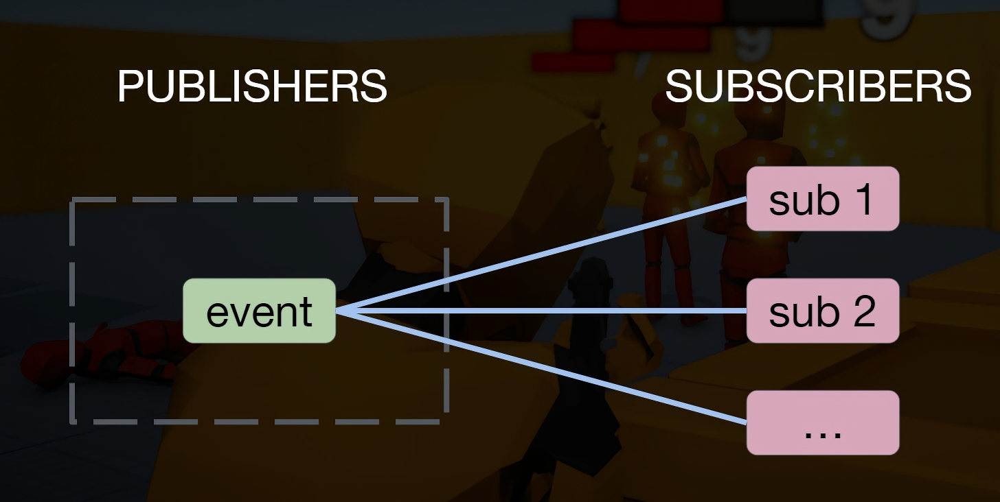

# TurnBased
game made on unity

1. transition duration  and transition offset allow for smoth blending of different animations
2. going to Edit-> ScriptExecutionOrder we can change the order of execution of script so when we need a script that is crucial to be run before default time we just drag it
